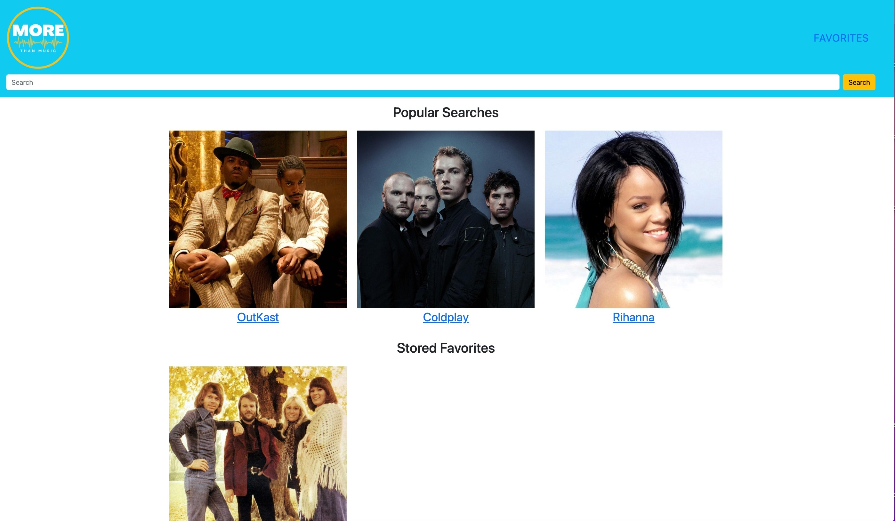

# More Than Music

## Table of Contents
1. [Description](#description)
2. [Visuals](#visuals)
3. [Usage](#Usage)
4. [Contributors](#contributors)

## Description
[link to live site](https://dstelzl.github.io/more-than-music/)
Music fan application designed to retrieve and store images, biographical information, and current news about specific artists. This application allows the user to search and save favorites. The data for this project is dynamically pulled from theaudioDB API and The New York Times article search API.

## Visuals

.jpg)

## Usage
Top artists dynamically displayed on home page with saved favorites displayed below. Search bar at the top of home and artist page. User can type an artist name into the search input field, and click submit. On submit, user is redirected to a results page that loads API information dynamically on page. If user chooses to add to favorites, they do so by clicking 'Add to Favorites' button. Favorites section on home page is populated from local storage to display user selected favorites.

## Contributors
Zach van Dijk
Heather Cruz
Deborah Stelzl